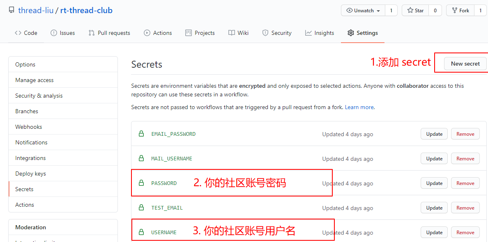
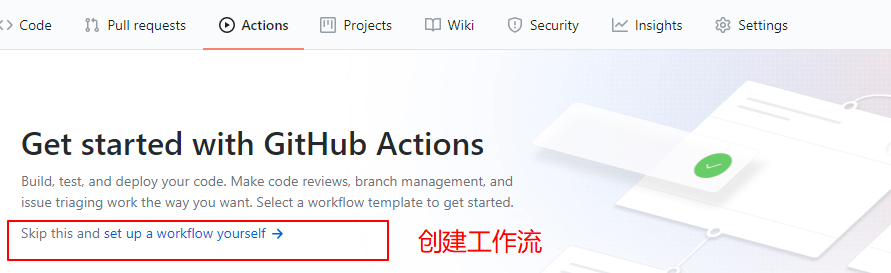
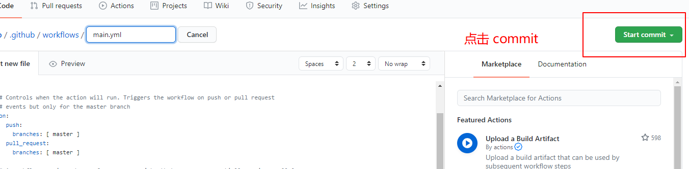
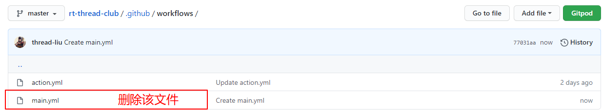
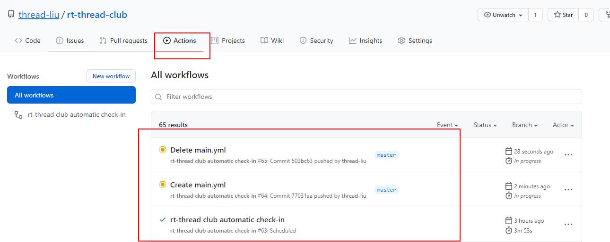
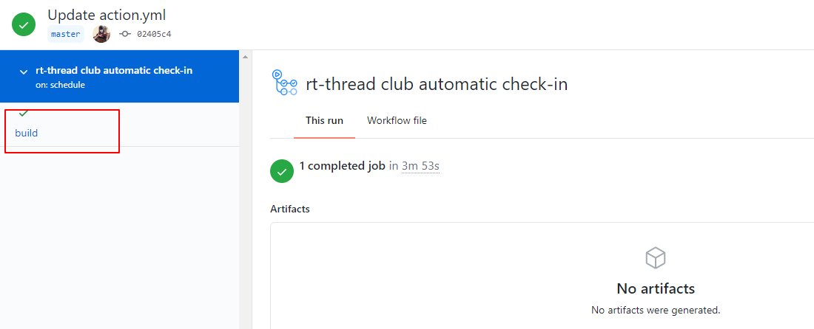
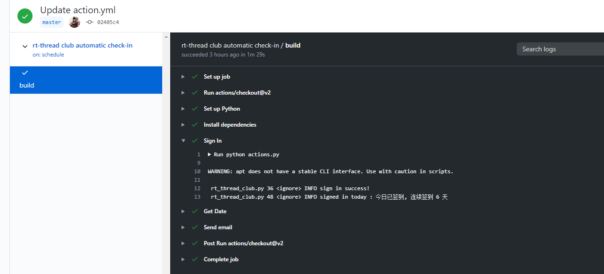
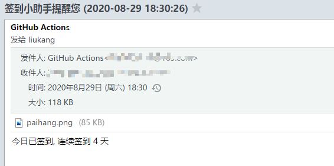

# 使用教程

## 简介

论坛签到需要每天手动去签到，可能某天有事情忘记签到，之前连续签到的记录就没了。基于这种状况，自动化签到脚本就诞生啦。该 CI 脚本会在每天 UTC 00:00，国内时间 8 点左右自动执行，实现机器人自动签到，无论风吹雨打，只要地球不毁灭，签到永不止步！

- fork 本仓库到你的仓库

- 点击 Settings 设置 Secrets，如下图所示：

  

  

- 点击 Actions 创建工作流

- 创建 yml 文件

  

- 上面的 yml 文件是自动创建的 yml，不是我们需要的，我们需要的 yml 文件已经创建完成，所以需要删除自动生成的 yml 文件。

  

- 一个工作流就已经创建完成，点击 actions 就可以看到所有的 Ations

  

- 查看工作流的具体信息，点击一个工作流，`rt-thread club automatic check-in` 为例：

  

  

- 点击 build，点击右边的小箭头就可以查看运行信息，可以看到已经成功签到。

  

## 邮件服务

邮件服务会在签到完成后发送邮件到你的邮箱，效果图如下所示：

